# Predecir_respuestas_de_tweets

proyecto para la materia `Text Mining`, `2021 FAMAF UNC`

Autor: `Joaquin Feltes`

Profesora: `Laura Alonso Alemany`

# Introduccion

La idea principal es predecir cuántas respuestas va a tener un tweet. Para esto se tomo el aproach de tarea de pretexto, usando la cantidad de respuestas de un tuit para generar una tag para el entrenamiento del modelo de preddicion. Ademas, se va a utilizar el predictor de respuestas para ser agregado a un pipeline de generacion de respuestas a tuits. Este generador fue el trabajo final de [Lautaro Martinez](github.com/LMartinezEXEX/Generador_Contestaciones), un compañero de la materia.

# Dataset

El dataset fue el creado por Mariano Schmidt, para su tesis de Licenciatura: Explotando características contextuales para la detección de posturas en Twitter en el marco de la vacunación del COVID-19 en Argentina. Para pedir el dataset pueden pedirmelo por privado y tambien dejo su [github](https://github.com/mschmidt4).

El dataset contiene 163.180 tweets en español.

y tiene las siguientes caracteristicas:

- created_at: contiene la fecha de envio del tweet a la aplicación.
- id_str: contiene el ID especifico del tweet.
- full_text: contiene el texto generado por el usuario del tweet.
- in_reply_to_status_id: de existir, contiene el ID del tweet al cual se esta respondiendo.
- in_reply_to_user_id: de existir, contiene el ID del usuario del tweet al cual se estra respondiendo.
- user.id: contiene el ID especifico del usuario que creo el tweet.

# Consideraciones y enfoques

En principio el trabajo de predecir cuantas respuestas va a tener un tweet puede parecer sencillo, pero hay que tener en cuenta todos los distintos enfoques que son posibles para entrenar un modelo y todas las caracteristicas que pueden agregarse a este para mejorar la prediccion. Por esto se van a mostrar en este trabajo varios enfoques que han sido tomados, para el metodo de entrenamiento pero tambien para la clasificacion de los tweets.

# Preproceso

Lo primero que se hace con el dataset es la eliminacion de arrobas, hashtags y urls. No hubo mucho trabajo de ingenieria en esta parte del proyecto, ya que muchos companieros que utilizaron el mismo dataset se concentraron en esto y por lo general hicieron un preproceso similar a este.

Luego se cuenta para cada tuit la cantidad de respuestas que posee, para agregarlo como una nueva caracteristica 'ans'.

# Division del Dataset

Como ya se dijo, una parte importante del trabajo es la division en clases de las cantidades de respuestas, ya que esto es lo que se quiere predecir con el modelo final. Este proceso se llevo a cabo en el archivo `Parseo_dataset.ipynb`

Primero para observar la distribucion de respuestas de los tweets del dataset tenemos el siguiente histograma:

## 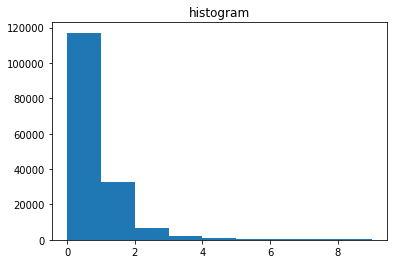

Aqui se puede ver un gran problema, hay una excesiva cantidad de tuits con 0 respuestas, y vemos como baja rapidamente la cantidad ya llegando a 4. Se tiene una distribucion exponencial inversa. Esto tiene mucho sentido, ya que es lo mas comun que un tuit tenga 0 o 1 respuestas.

Por esta razon, se deben dividir en clases, para que cada clase tenga una cantidad de representantes similar a la de las otras. Mas adelante se vera que si no se hace esto, los modelos tienden a aprender solo por la cantidad de representantes y una clase sobrerepresentada va a hacer que se predigan muchos elementos para ella.

Se tomo como parametro para la cantidad 6500 representantes, ya que hay aproximadamente esa cantidad con 2 respuestas y tambien con 3 o mas. Se tomaron tambien en cuenta divisiones con mas clases, separando en 3-4, 5-7 ,7-10 , +10, pero la cantidad de representantes era muy baja, y no se generaron resultados satisfactorios para esas divisiones. Otra division interesante, que no se ha llegado a explorar demasiado es la de separar entre 0 , pocas y muchas respuestas. O incluso es interesante la division entre ninguna o alguna respuesta.

Haciendo entonces la division por clases de [0, 1, 2, +3] tenemos la siguiente distribucion de respuestas:

## 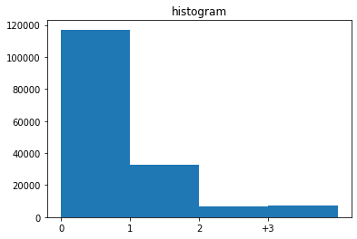

Ahora redujimos bastante el problema, ya que no tenemos infinitas cantidades de respuestas posibles, solo lo limitamos a 4 clases pensando que los tuits de mas de 2 respuestas van a pertenecer todos al mismo grupo.

Pero todavia tenemos el problema de la sobrepoblacion de la clase del 0 y en menor medida, la del 1.

Lo que se decidio para que la cantidad de elementos sea aproximadamente la misma que las de las otras dos clases, fue dividir la clase del 0 en 18 subgrupos y la del 1 en 5 subgrupos, todos tomados al azar.

Con esto en mente, podemos ver como queda el histograma de las clases divididas exactamente con 1/18 de la clase del 0 y 1/5 de la del 1:

## 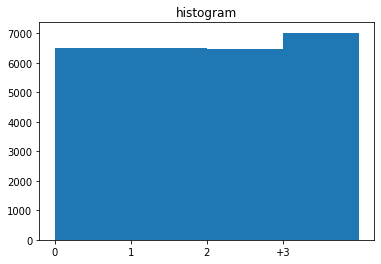

Vemos que esto deja los datos muchisimo mejor, ahora todas las clases tienen aproximadamente la misma cantidad de elementos y no deberia haber sezgo en el entrenamiento de datos.

Para la division en subgrupos, se tomaron hizo una division al azar con el framework de pandas, por lo que los resultados enseñados a continuacion no van a poder replicarse exactamente.

Por ultimo se dividio todo el dataset para tener un 80% para entrenamiento, 10% develop y 10% para testeo final.

# Aproximaciones

## Bag of words con CountVectorizer

### Primer aproximacion

Esta parte del proceso se llevo a cabo en el archivo `Entrenamiento.ipynb`

La primera aproximacion que se tomo fue utilizando [CountVectorizer](https://scikit-learn.org/stable/modules/generated/sklearn.feature_extraction.text.CountVectorizer.html) de sklearn para representar los tweets con "Bag of words" (bolsa de palabras). Esto significa que cada tweet va a ser un vector, donde cada dimension es una palabra del vocabulario. Se tomo como vocabulario las 15000 palabras mas recurrentes del dataset, para mayor eficiencia y facilidad en manejo de memoria pero tambien para no incluir muchas palabras que ocurren solo una vez en todo el dataset y no van a aportar nada interesante.

La primera aproximacion que se hizo, que se puede ver en las primeras versiones de git del proyecto, fue con la division de clases [0,1,2-3,4-6,7-10,11-20,20+]. Esta fue tomada al azar, para tener una primera observacion de como se comportaba el modelo. Aqui se puede ver la Matriz de confusion de esta aproximacion.

## 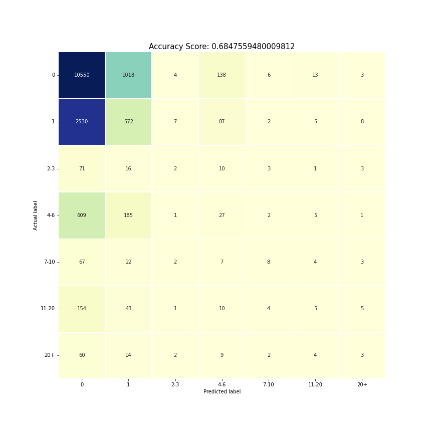

Se puede observar que a la mayoria de elementos se les asigno la clase de 0 respuestas, esto da un buen resultado general (68,4% de acierto), pero haciendo el analisis de la matriz de confusion, se puede notar que la diagonal (donde se encuentran los resultados correctos) solo tiene la mayoria de la fila en la clase del 0. Aca podemos ver con claridad el sezgo por la sobrepoblacion de la clase, el cual se podria discutir que no es tan malo, si en las muestras reales de tweets la mayoria tiene esa cantidad de respuestas. Pero hay que recalcar que no se quiere conseguir un alto porcentaje de acierto prediciendo siempre que un tuit va a tener 0 respuestas, esto no nos genera ningun aprendizaje ni aporta ningun beneficio.

Luego la primer aproximacion que se hizo utilizando la division [0, 1, 2, +3] pero aun sin utilizar los subgrupos de 0 y 1, tuvo resultados similares al anterior, acumulandose las predicciones en el lado de 0 respuestas, pero teniendo los datos mucho mas compactos lo cual facilita su visualizacion. Algo a remarcar es que para este entrenamiento no se utilizo en su totalidad el dataset para entre namiento, ya que saturaban la memoria del Google colab. Se tomo entonces los primeros 25000 tuits, que siguen respresentando una buena cantidad.

## 

### utilizando las subdivisiones de 0 y 1

Para que la prediccion no se base en la cantidad de elementos, si no que se concentre en realmente el contenido del tweet, separamos la clase del 0 y del 1 en otros nuevos dataframes, los cuales estan marcados con subgrupos para ser entrenados por separado y tomar el promedio entre los resultados. Se corrieron las 90 combinaciones de subgrupos de clases, combinandolas con el resto de tweets. Luego se guardo un par de indices random para obtener la matriz de confusion:

## 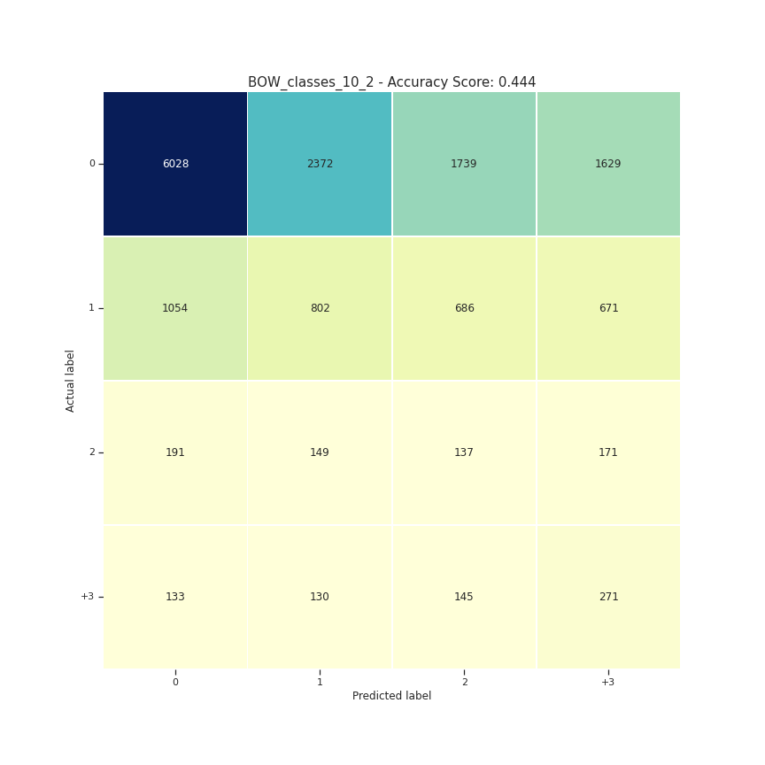

Lo primero que se puede notar, es que el porcentaje general baja abruptamente, cerca de un 24%. Pero ahora se puede decir que el modelo esta realmente prediciendo por lo que ve en los vectores de los tweets, y no tanto en que clase tiene mas elementos. Vemos que la clase del 0 tiene ahora un poco mas de 50% de predicciones correctas, la del 1 un 30%, la del 2 es la peor, siendo su label real la que menos predijo el modelo (20%), y por ultimo la clsae de +3 con un 40 % de acierto. Se puede decir tambien que al estar gran parte de los tweets con 0 bien representados (que es la clase con mas elementos de testeo) eso subio la estadistica, pero se ve un gran avance en el resto de las clases para el pequenio cambio que se hizo.

### Con las subdivisiones y clases discretas

Para analizar un poco mejor las cantidades de respuestas, sin depender de las clases que asignamos, se va a hacer un analisis tomando como las clases los primeros 20 enteros.

## 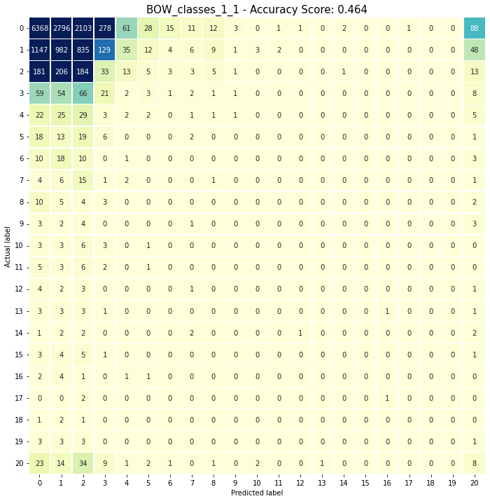

Podemos ver que el porcentaje general aumento por unos pocos puntos, pero nuevamente vemos una acumulacion grande en las clases de pocas respuestas, esta vez como los subgrupos de 0 y 1 y la clase de 2 tienen la misma cantidad de elementos, se puede ver que se repartieron la mayoria de predicciones en estas columnas, y avanzando en la diagonal lejos de la esquina superior izquiera, podemos ver que todas las preddicciones dan 0%. La clase del 20, tiene un poco mas de elementos, ya que acumula todos los tuits de 20 o mas respuestas, y tuvo un poco mas de representacion, pero igualmente su porcentaje de acierto fue menor al 10%.

Podemos observar en el siguiente histograma la cantidad de elementos que tenia cada clase para el entrenamiento, lo cual nos explica porque las clases del medio no estan bien representadas.

## 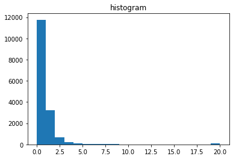

Una de las razones por las que se tomo esta aproximacion fue para ver si valia la pena hacer una division de clases dependiendo de como juntaba el modelo las respuestas si se observaban todas las clases juntas. Pero al tener tan pocos datos marcados con mas de 3 respuestas, es dificil hacer esta division y que de algun valor. Igualmente se intento hacer la siguiente aproximacion:

## 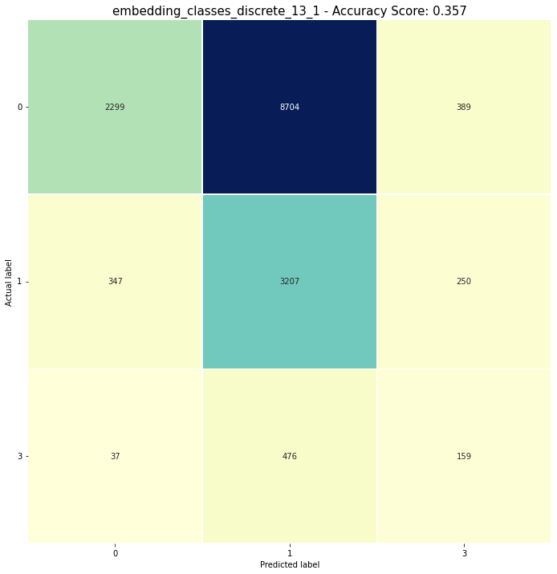

Donde se dividio en 0, 1-2 y +3. Se puede ver que esta division no fue muy buena, probablemente porque la cantidad de elementos de la clase de 1-2 era el doble que de las otras hizo que sea sobrerepresentada. Pero al haber dado un porcentaje tan bajo, no se decidio seguir investigando por esa rama.

## Embeddings utilizando fasttext

Para el uso de embeddings con fasttext se tomo como ejemplo el trabajo de [Nazareno Garagiola](https://github.com/NazaGara/tm_seriesTV), otro compañero de la materia. Se usaron embeddings con fasttext de twitter en español `fasttext_spanish_twitter_100d`. Para conseguir estos embeddings pueden pedirlos a cualquiera de nosotros dos.

Para el proceso de embeddings se hacen algunos preprocesos extra, bastante similares a los que ya utilizamos.

Usamos la libreria [pickle](https://docs.python.org/es/3/library/pickle.html) para guardar el preproceso y no hacerlo cada vez que corremos el codigo.
!Importante! esto guarda los tweets preprocesados en drive, y al ejecutarlo con las 90 clases, llega a ocupar cerca de 3GB.

### Primer aproximacion

La primer aproximacion usando las clases de [0, 1, 2, +3] pero sin utilizar los subgrupos de 0 y 1 tuvo resultados parecidos a su similar con BOW, con un porcentaje un poco mayor, pero tambien con mas predicciones de la clase del 0, dejando la clase de 2 respuestas con solo una prediccion que ademas fue incorrecta (era para un tuit con 1 respuesta).

## 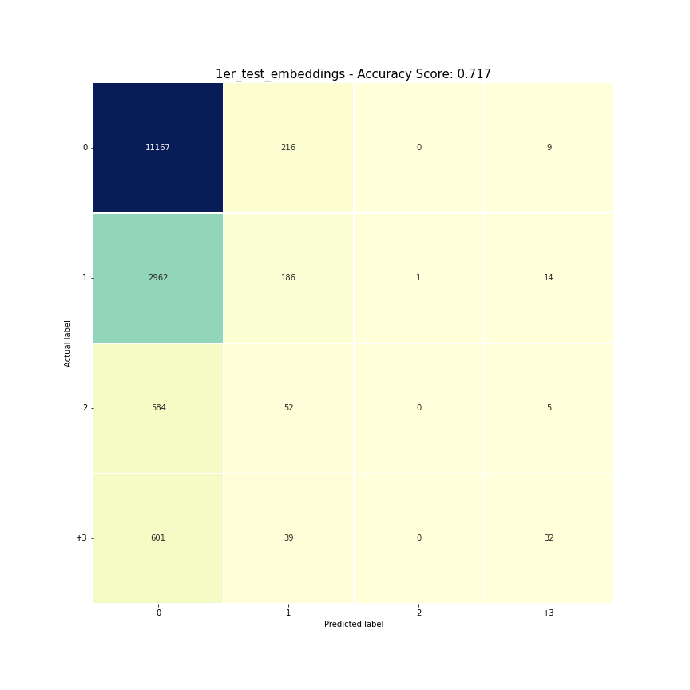

### utilizando las subdivisiones de 0 y 1

Cuando usamos las divisiones de las clases del 0 y el 1, perdemos unos puntos porcentuales del total(20%), pero ganamos bastante representacion en las clases mas pequeñas:

## 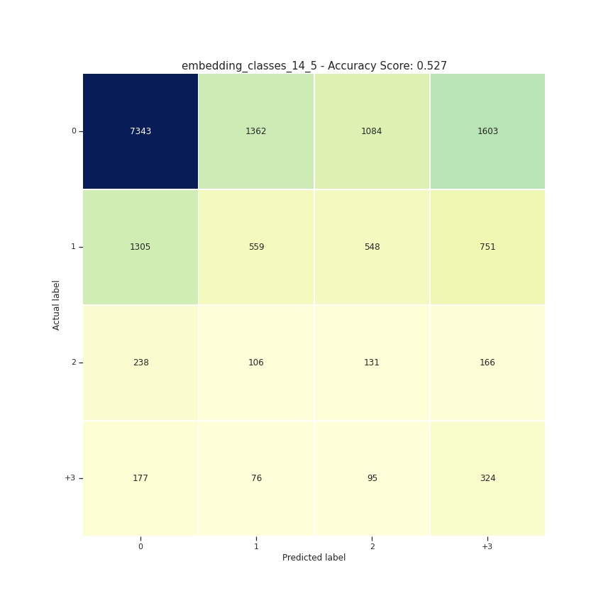

Tenemos un 62% de acierto en la clase del 0, 10% mas que lo que se tenia en el metodo con BOW. La clase del 1 se ve poco representada, con un 18%, 12 puntos menos que lo que tenia en BOW, y lo mismo pasa con la del 2, que vuelve a ser la que menos porcentaje tiene en su fila (tambien 18%) pero por ultimo la clase de +3 tiene un 47%, 7 puntos mas que lo que tenia en BOW, por lo que con embeddings vemos que se representaron las clases de los extremos, lo cual tiene sentido.

### Con las subdivisiones y clases discretas

Nuevamente se probo usar las clases discretas, y se obtuvieron resultados muy parecidos a los de BOW. Que aunque suba el porcentaje de acierto general por unos pocos puntos, no vale la pena porque pierden representacion las clases del medio.

## 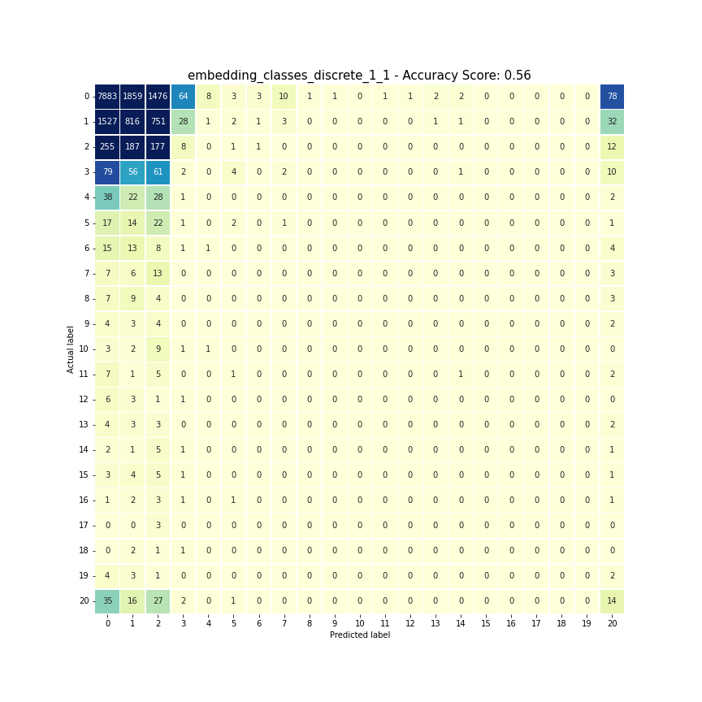

## Conclusion

Como conclusion de esta etapa, podemos decir que la cantidad de representantes fue una gran influencia en las predicciones de cantidades de respuestas. Pero no hay que quedarse solo con eso, hay que apreciar el trabajo logrado para la division de clases, que como vimos comparando con otras, la division elegida fue bastante buena. Tambien recalcar que el uso de embeddings mejoro el rendimiento, lo cual es importante para tener en cuenta.

Podemos ver en el siguiente boxplot la comparacion final de los metodos.

## 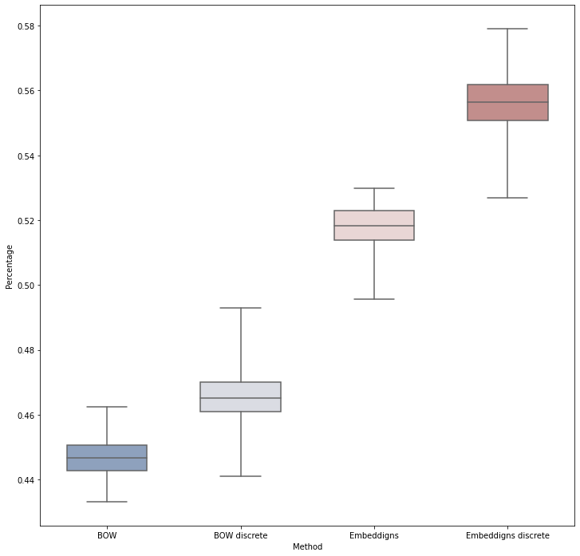

Se puede ver que el salto de utilizar embeddings es importante, y que a su vez los embeddings en clases discretas tienen bastante ventaja, pero como ya vimos en el analisis un poco mas cualitativo del resultado de cada clase, es mas valorable tener las clases pequeñas bien representadas tambien.

Por ultimo para cerrar esta parte, hay que remarcar que se puede hacer mucha ingenieria a los datos para exprimirlos mejor, usando por ejemplo bigramas o trigramas, DocVectorizer y muchos otros metodos de analisis de texto.

# Prediccion de respuestas como parte de un Pipeline

Como se dijo anteriormente, se trabajo con el proyecto de [Lautaro Martinez](github.com/LMartinezEXEX/Generador_Contestaciones).

La idea principal es que con los modelos de generacion de respuestas, se haga un analisis estas dependiendo cuantas respuestas predijo mi modelo que iba a tener el tweet. Por ejemplo, un tuit al que mi modelo predijo 0 respuestas, se espera que tenga una respuesta generada de menor calidad que a uno que se predijo +3.

Para esto, la idea era usar los 4 modelos de clusters entrenados que utiliza Lautaro, tomando los centroides de cada cluster. Con los centroides de cada cluster la idea es que se compare la distancia coseno a cada uno con el tuit al que se quiere generar la respuesta.

LAUTI MARTINEZ
-AGREGAR COMO LO UNIRIA DEL TODO
-AGREGAR LOS CAMBIOS QUE HICE, CREO QUE FUERON SOLO EN MAIN, FIJARSE EN EL DRIVE
