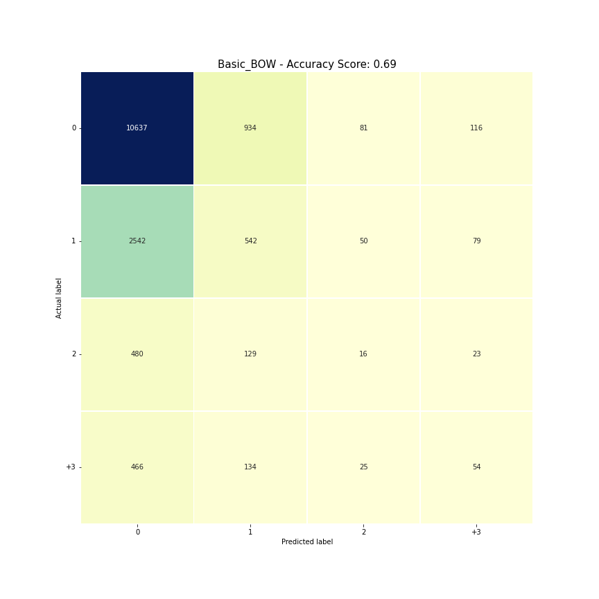

# Predecir_respuestas_de_tweets

proyecto para la materia `Text Mining`, `2021 FAMAF UNC`

Autor: `Joaquín Feltes`

Profesora: `Laura Alonso Alemany`

# Introducción

La idea principal es predecir cuántas respuestas va a tener un tweet. Para esto se tomó el approach de tarea de pretexto, usando la cantidad de respuestas de un tuit para generar una tag para el entrenamiento del modelo de predicción. Además, se va a utilizar el predictor de respuestas para ser agregado a un pipeline de generación de respuestas a tuits. Este generador fue el trabajo final de [Lautaro Martinez](github.com/LMartinezEXEX/Generador_Contestaciones), un compañero de la materia.

# Dataset

El dataset fue creado por Mariano Schmidt, para su tesis de Licenciatura: Explotando características contextuales para la detección de posturas en Twitter en el marco de la vacunación del COVID-19 en Argentina. Para pedir el dataset pueden pedirmelo por privado y también dejo su [github](https://github.com/mschmidt4).

El dataset contiene 163.180 tweets en español.

y tiene las siguientes características:

- created_at: contiene la fecha de envío del tweet a la aplicación.
- id_str: contiene el ID específico del tweet.
- full_text: contiene el texto generado por el usuario del tweet.
- in_reply_to_status_id: de existir, contiene el ID del tweet al cual se está respondiendo.
- in_reply_to_user_id: de existir, contiene el ID del usuario del tweet al cual se está respondiendo.
- user.id: contiene el ID específico del usuario que creó el tweet.

# Consideraciones y enfoques

En principio el trabajo de predecir cuántas respuestas va a tener un tweet puede parecer sencillo, pero hay que tener en cuenta todos los distintos enfoques que son posibles para entrenar un modelo y todas las características que pueden agregarse a este para mejorar la predicción. Por esto se van a mostrar en este trabajo varios enfoques que han sido tomados, para el método de entrenamiento pero también para la clasificación de los tweets.

# Preproceso

Lo primero que se hace con el dataset es la eliminación de arrobas, hashtags y urls. No hubo mucho trabajo de ingeniería en esta parte del proyecto, ya que muchos compañeros que utilizaron el mismo dataset se concentraron en esto y por lo general hicieron un preproceso similar a este.

Luego se cuenta para cada tuit la cantidad de respuestas que posee, para agregarlo como una nueva característica 'ans'.

# División del Dataset

Como ya se dijo, una parte importante del trabajo es la división en clases de las cantidades de respuestas, ya que esto es lo que se quiere predecir con el modelo final. Este proceso se llevó a cabo en el archivo `Parseo_dataset.ipynb`

Primero para observar la distribución de respuestas de los tweets del dataset tenemos el siguiente histograma:

## 

Aquí se puede ver un gran problema, hay una excesiva cantidad de tuits con 0 respuestas, y vemos como baja rápidamente la cantidad ya llegando a 4. Se tiene una distribución exponencial inversa. Esto tiene mucho sentido, ya que es lo más común que un tuit tenga 0 o 1 respuestas.

Por esta razón, se deben dividir en clases, para que cada clase tenga una cantidad de representantes similar a la de las otras. Más adelante se verá que si no se hace esto, los modelos tienden a aprender solo por la cantidad de representantes y una clase sobrerrepresentada va a hacer que se predigan muchos elementos para ella.

Se tomó como parámetro para la cantidad 6500 representantes, ya que hay aproximadamente esa cantidad con 2 respuestas y también con 3 o más. Se tomaron también en cuenta divisiones con más clases, separando en 3-4, 5-7 ,7-10 , +10, pero la cantidad de representantes era muy baja, y no se generaron resultados satisfactorios para esas divisiones. Otra división interesante, que no se ha llegado a explorar demasiado es la de separar entre 0 , pocas y muchas respuestas. O incluso es interesante la división entre ninguna o alguna respuesta.

Haciendo entonces la división por clases de [0, 1, 2, +3] tenemos la siguiente distribución de respuestas:

## 

Ahora reducimos bastante el problema, ya que no tenemos infinitas cantidades de respuestas posibles, sólo lo limitamos a 4 clases pensando que los tuits de más de 2 respuestas van a pertenecer todos al mismo grupo.

Pero todavía tenemos el problema de la sobrepoblación de la clase del 0 y en menor medida, la del 1.

Lo que se decidió para que la cantidad de elementos sea aproximadamente la misma que las de las otras dos clases, fue dividir la clase del 0 en 18 subgrupos y la del 1 en 5 subgrupos, todos tomados al azar.

Con esto en mente, podemos ver como queda el histograma de las clases divididas exactamente con 1/18 de la clase del 0 y 1/5 de la del 1:

## 

Vemos que esto deja los datos muchísimo mejor, ahora todas las clases tienen aproximadamente la misma cantidad de elementos y no debería haber sesgo en el entrenamiento de datos.

Para la división en subgrupos, se tomaron hizo una división al azar con el framework de pandas, por lo que los resultados enseñados a continuación no van a poder replicarse exactamente.

Por último se dividió todo el dataset para tener un 80% para entrenamiento, 10% develop y 10% para testeo final.

# Aproximaciones

## Bag of words con CountVectorizer

### Primer aproximación

Esta parte del proceso se llevó a cabo en el archivo `Entrenamiento.ipynb`

La primera aproximacion que se tomo fue utilizando [CountVectorizer](https://scikit-learn.org/stable/modules/generated/sklearn.feature_extraction.text.CountVectorizer.html) de sklearn para representar los tweets con "Bag of words" (bolsa de palabras). Esto significa que cada tweet va a ser un vector, donde cada dimensión es una palabra del vocabulario. Se tomó como vocabulario las 15000 palabras más recurrentes del dataset, para mayor eficiencia y facilidad en manejo de memoria pero también para no incluir muchas palabras que ocurren solo una vez en todo el dataset y no van a aportar nada interesante.

La primera aproximación que se hizo, que se puede ver en las primeras versiones de git del proyecto, fue con la división de clases [0,1,2-3,4-6,7-10,11-20,20+]. Esta fue tomada al azar, para tener una primera observación de cómo se comportaba el modelo. Aquí se puede ver la Matriz de confusión de esta aproximación.

## 

Se puede observar que a la mayoría de elementos se les asignó la clase de 0 respuestas, esto da un buen resultado general (68,4% de acierto), pero haciendo el análisis de la matriz de confusión, se puede notar que la diagonal (donde se encuentran los resultados correctos) solo tiene la mayoría de la fila en la clase del 0. Aca podemos ver con claridad el sesgo por la sobrepoblación de la clase, el cual se podría discutir que no es tan malo, si en las muestras reales de tweets la mayoría tiene esa cantidad de respuestas. Pero hay que recalcar que no se quiere conseguir un alto porcentaje de acierto prediciendo siempre que un tuit va a tener 0 respuestas, esto no nos genera ningún aprendizaje ni aporta ningún beneficio.

Luego la primer aproximación que se hizo utilizando la división [0, 1, 2, +3] pero aun sin utilizar los subgrupos de 0 y 1, tuvo resultados similares al anterior, acumulandose las predicciones en el lado de 0 respuestas, pero teniendo los datos mucho más compactos lo cual facilita su visualización. Algo a remarcar es que para este entrenamiento no se utilizó en su totalidad el dataset para entrenamiento, ya que saturan la memoria del Google colab. Se tomaron entonces los primeros 25000 tuits, que siguen representando una buena cantidad.

## 

### utilizando las subdivisiones de 0 y 1

Para que la predicción no se base en la cantidad de elementos, sino que se concentre en realmente el contenido del tweet, separamos la clase del 0 y del 1 en otros nuevos dataframes, los cuales están marcados con subgrupos para ser entrenados por separado y tomar el promedio entre los resultados. Se corrieron las 90 combinaciones de subgrupos de clases, combinandolas con el resto de tweets. Luego se guardo un par de índices random para obtener la matriz de confusión:

## 

Lo primero que se puede notar, es que el porcentaje general baja abruptamente, cerca de un 24%. Pero ahora se puede decir que el modelo está realmente prediciendo por lo que ve en los vectores de los tweets, y no tanto en que clase tiene más elementos. Vemos que la clase del 0 tiene ahora un poco más de 50% de predicciones correctas, la del 1 un 30%, la del 2 es la peor, siendo su label real la que menos predijo el modelo (20%), y por último la clase de +3 con un 40 % de acierto. Se puede decir también que al estar gran parte de los tweets con 0 bien representados (que es la clase con más elementos de testeo) eso subió la estadística, pero se ve un gran avance en el resto de las clases para el pequeño cambio que se hizo.

### Con las subdivisiones y clases discretas

Para analizar un poco mejor las cantidades de respuestas, sin depender de las clases que asignamos, se va a hacer un análisis tomando como las clases los primeros 20 enteros.

## 

Podemos ver que el porcentaje general aumento por unos pocos puntos, pero nuevamente vemos una acumulacion grande en las clases de pocas respuestas, esta vez como los subgrupos de 0 y 1 y la clase de 2 tienen la misma cantidad de elementos, se puede ver que se repartieron la mayoría de predicciones en estas columnas, y avanzando en la diagonal lejos de la esquina superior izquierda, podemos ver que todas las predicciones dan 0%. La clase del 20, tiene un poco más de elementos, ya que acumula todos los tuits de 20 o más respuestas, y tuvo un poco más de representación, pero igualmente su porcentaje de acierto fue menor al 10%.

Podemos observar en el siguiente histograma la cantidad de elementos que tenía cada clase para el entrenamiento, lo cual nos explica porque las clases del medio no están bien representadas.

## 

Una de las razones por las que se tomó esta aproximación fue para ver si valía la pena hacer una división de clases dependiendo de cómo juntaba el modelo las respuestas si se observaban todas las clases juntas. Pero al tener tan pocos datos marcados con más de 3 respuestas, es difícil hacer esta división y que de algún valor. Igualmente se intentó hacer la siguiente aproximación:

## 

Donde se dividió en 0, 1-2 y +3. Se puede ver que esta división no fue muy buena, probablemente porque la cantidad de elementos de la clase de 1-2 era el doble que de las otras hizo que sea sobrerrepresentada. Pero al haber dado un porcentaje tan bajo, no se decidió seguir investigando por esa rama.

## Embeddings utilizando fasttext

Para el uso de embeddings con fasttext se tomó como ejemplo el trabajo de [Nazareno Garagiola](https://github.com/NazaGara/tm_seriesTV), otro compañero de la materia. Se usaron embeddings con fasttext de twitter en español `fasttext_spanish_twitter_100d`. Para conseguir estos embeddings pueden pedirlos a cualquiera de nosotros dos.

Para el proceso de embeddings se hacen algunos preprocesos extra, bastante similares a los que ya utilizamos.

Usamos la librería [pickle](https://docs.python.org/es/3/library/pickle.html) para guardar el preproceso y no hacerlo cada vez que corremos el código.
¡Importante! Esto guarda los tweets preprocesados en drive, y al ejecutarlo con las 90 clases, llega a ocupar cerca de 3GB.

### Primer aproximación

La primer aproximación usando las clases de [0, 1, 2, +3] pero sin utilizar los subgrupos de 0 y 1 tuvo resultados parecidos a su similar con BOW, con un porcentaje un poco mayor, pero también con más predicciones de la clase del 0, dejando la clase de 2 respuestas con solo una predicción que además fue incorrecta (era para un tuit con 1 respuesta).

## 

### utilizando las subdivisiones de 0 y 1

Cuando usamos las divisiones de las clases del 0 y el 1, perdemos unos puntos porcentuales del total(20%), pero ganamos bastante representación en las clases más pequeñas:

## 

Tenemos un 62% de acierto en la clase del 0, 10% más que lo que se tenía en el método con BOW. La clase del 1 se ve poco representada, con un 18%, 12 puntos menos que lo que tenía en BOW, y lo mismo pasa con la del 2, que vuelve a ser la que menos porcentaje tiene en su fila (también 18%) pero por último la clase de +3 tiene un 47%, 7 puntos más que lo que tenía en BOW, por lo que con embeddings vemos que se representaron las clases de los extremos, lo cual tiene sentido.

### Con las subdivisiones y clases discretas

Nuevamente se probó usar las clases discretas, y se obtuvieron resultados muy parecidos a los de BOW. Que aunque suba el porcentaje de acierto general por unos pocos puntos, no vale la pena porque pierden representación las clases del medio.

## 

## Conclusión

Como conclusión de esta etapa, podemos decir que la cantidad de representantes fue una gran influencia en las predicciones de cantidades de respuestas. Pero no hay que quedarse solo con eso, hay que apreciar el trabajo logrado para la división de clases, que como vimos comparando con otras, la división elegida fue bastante buena. También recalcar que el uso de embeddings mejoro el rendimiento, lo cual es importante para tener en cuenta.

Podemos ver en el siguiente boxplot la comparación final de los métodos.

## 

Se puede ver que el salto de utilizar embeddings es importante, y que a su vez los embeddings en clases discretas tienen bastante ventaja, pero como ya vimos en el análisis un poco más cualitativo del resultado de cada clase, es más valorable tener las clases pequeñas bien representadas también.

Por último para cerrar esta parte, hay que remarcar que se puede hacer mucha ingeniería a los datos para exprimirlos mejor, usando por ejemplo bigramas o trigramas, DocVectorizer y muchos otros metodos de analisis de texto.

# Predicción de respuestas como parte de un Pipeline

Como se dijo anteriormente, se trabajó con el proyecto de [Lautaro Martinez](github.com/LMartinezEXEX/Generador_Contestaciones).

La idea principal es que con los modelos de generación de respuestas, se haga un análisis estas dependiendo cuantas respuestas predijo mi modelo que iba a tener el tweet. Por ejemplo, un tuit al que mi modelo predijo 0 respuestas, se espera que tenga una respuesta generada de menor calidad que a uno que se predijo +3.

Para esto, la idea era usar los 4 modelos de clusters entrenados que utiliza Lautaro, tomando los centroides de cada cluster. Con los centroides de cada cluster la idea es que se compare la distancia coseno a cada uno con el tuit al que se quiere generar la respuesta. Luego el que tenga menor distancia va a ser el cluster cuyo modelo pre entrenado se va a usar para generar la respuesta. Luego analizamos la cantidad de respuestas que predijo mi modelo y vemos la calidad de respuesta generada. Se puede agregar mi modelo al pipeline de Lautaro chequeando que la cantidad de respuestas predicha sea mayor a 0, ya que si es 0 no vale la pena que ese tuit sea contestado.

Por dificultades con el entrenamiento, no se hizo la parte de los centroides si no que se tomó directamente el cluster 1 y se hizo la parte del análisis de calidad de respuesta.

Tomamos los siguientes tweets con su cantidad de respuestas y la predicción de este valor:

```
++++++++++++++++++++++++++++++++++++++++++++++++++++++++++++++++++++++++++++++++++++++++++++++++++++++++++++++++++++++++++++++++++++++++++++++++++++++++++++++++++++++++++++++++++++
porque el pami no lo maneja un jubilado todos tienen sindicatos pq el pami no, digo por ahi puede ser una solucion que manejen su propia plata estoy delirando sorry
cantidad de respuestas:   0
preddicion con el modelo: 2
++++++++++++++++++++++++++++++++++++++++++++++++++++++++++++++++++++++++++++++++++++++++++++++++++++++++++++++++++++++++++++++++++++++++++++++++++++++++++++++++++++++++++++++++++++
No te estoy diciendo nada a vos. Te sigo hace tiempo y sé que siempre pedís transparencia, no sólo con las vacunas. Simplemente digo que no se puede vivir permanentemente con las libertades restringidas y que hay que tener cuidado al decir esto importa más que aquello.
cantidad de respuestas:   0
preddicion con el modelo: 2
++++++++++++++++++++++++++++++++++++++++++++++++++++++++++++++++++++++++++++++++++++++++++++++++++++++++++++++++++++++++++++++++++++++++++++++++++++++++++++++++++++++++++++++++++++
Y tenemos que aplaudir?
cantidad de respuestas:   0
preddicion con el modelo: 0
++++++++++++++++++++++++++++++++++++++++++++++++++++++++++++++++++++++++++++++++++++++++++++++++++++++++++++++++++++++++++++++++++++++++++++++++++++++++++++++++++++++++++++++++++++
.

.
cantidad de respuestas:   0
preddicion con el modelo: 0
++++++++++++++++++++++++++++++++++++++++++++++++++++++++++++++++++++++++++++++++++++++++++++++++++++++++++++++++++++++++++++++++++++++++++++++++++++++++++++++++++++++++++++++++++++
Te repito. REPELOTUDO, la ANMAT solo recibió datos de un cortepreliminar.  O sea de una menor cantidad de casos, no recibió el informe final del estudio.
Veo que no leíste el informe de ANMAT. No habla de cantidad de ensayos, ni de porcentajes ni resultados finales.
cantidad de respuestas:   2
preddicion con el modelo: 2
++++++++++++++++++++++++++++++++++++++++++++++++++++++++++++++++++++++++++++++++++++++++++++++++++++++++++++++++++++++++++++++++++++++++++++++++++++++++++++++++++++++++++++++++++++
no mucho todavía
cantidad de respuestas:   1
preddicion con el modelo: 0
++++++++++++++++++++++++++++++++++++++++++++++++++++++++++++++++++++++++++++++++++++++++++++++++++++++++++++++++++++++++++++++++++++++++++++++++++++++++++++++++++++++++++++++++++++
Gracias!!!!!!❤
cantidad de respuestas:   0
predicción con el modelo: 0
++++++++++++++++++++++++++++++++++++++++++++++++++++++++++++++++++++++++++++++++++++++++++++++++++++++++++++++++++++++++++++++++++++++++++++++++++++++++++++++++++++++++++++++++++++
Encima es profesor. Mamita
cantidad de respuestas:   0
predicción con el modelo: 0
++++++++++++++++++++++++++++++++++++++++++++++++++++++++++++++++++++++++++++++++++++++++++++++++++++++++++++++++++++++++++++++++++++++++++++++++++++++++++++++++++++++++++++++++++++
che, que ganas de probar con Ernestito un litro de dióxido de cloro intravenoso
cantidad de respuestas:   0
predicción con el modelo: 0
++++++++++++++++++++++++++++++++++++++++++++++++++++++++++++++++++++++++++++++++++++++++++++++++++++++++++++++++++++++++++++++++++++++++++++++++++++++++++++++++++++++++++++++++++++
Y si hay vos no lo vas a decir....ya perdimos la inocencia mira si les vamos a creer 🤢
cantidad de respuestas:   0
predicción con el modelo: 0
```

Los tuits número 1, 2 y 5 fueron los que el modelo predijo que iban a tener 2 respuestas, para el resto se predijeron 0. Veamos las respuestas de estos:

1 - Tweet:

    porque el pami no lo maneja un jubilado todos tienen sindicatos pq el pami no, digo por ahi puede ser una solución que manejen su propia plata estoy delirando sorry

Respuesta:

    @spitta1969 Cuántos culos habrá lamido este inutil para llegar a un puesto donde debe ganar bastante?

Vemos que el primer tuit hace una pregunta sobre el pami, mientras que la respuesta que se genera es un ataque que poco esta relacionada a la pregunta.

2 - Tweet:

    No te estoy diciendo nada a vos. Te sigo hace tiempo y sé que siempre pedís transparencia, no sólo con las vacunas. Simplemente digo que no se puede vivir permanentemente con las libertades restringidas y que hay que tener cuidado al decir esto importa más que aquello.

Respuesta:

    @rquiroga777 Me parece que en el fondo todos sabemos que la cuarentena total ya es inevitable. Me parece que las restricciones son el preámbulo.

En el segundo tuit, se genera algo muy interesante, habla de manera bastante educada sobre las "libertades restringidas" refiriéndose probablemente a la cuarentena. Mientras que su respuesta generada, dice que la cuarentena total es inevitable y que las restricciones son el preámbulo de esta.

Es interesante marcar que aunque el modelo había predicho 2 respuestas, el tuit original no tenía ninguna, pero tiene mucho sentido que por la manera en que está escrito si tuviese. Y vimos que la respuesta generada tiene mucho sentido.

5 - Tweet:

    Te repito. REPELOTUDO, la ANMAT solo recibió datos de un cortepreliminar. O sea de una menor cantidad de casos, no recibió el informe final del estudio.
    Veo que no leíste el informe de ANMAT. No habla de cantidad de ensayos, ni de porcentajes ni resultados finales.

Respuesta:

    @NicoOlsze Yo recuerdo y tengo guardados los memes dónde pedían q vacunen a los políticos primero. No hay poronga q les venga bien. Lastima q no tengo seguidores. Jajaja

Por ultimo en el tercer tuit, habla muy violentamente sobre informes del ANMAT, seguramente de las vacunas, diciendo que estas no están aprobadas. Y la respuesta que se genera habla diciendo que la gente pedía que los políticos se vacunen primero y responde de manera un poco violenta también de que nada les viene bien. Se nota que son conversaciones diferentes, puesto que el primero habla de que no quiere que les pongan vacunas y el segundo le responde a alguien que probablemente se queja de que los políticos se vacunaron primero.

Igualmente, el tema general es bastante acertado, y sin prestar atención puede parecer una conversación normal de twitter.

Observando el resto de tuits, se nota que el modelo no pudo generar respuestas muy relacionadas al tema del tuit al que se contesta, lo cual era de esperar ya que nuestro modelo predijo que no iba a tener respuestas

Cabe remarcar que el tuit "no mucho todavía" se predijo con 0 respuestas a pesar que tiene 1 realmente. Esto indica que a pesar de que sea un fallo en la estadística, es una respuesta que tiene sentido ya que no hay mucho que contestar a este tweet, lo cual es alentador para el modelo. (Algo similar ocurrió con el tweet número 2 mostrado anteriormente).
